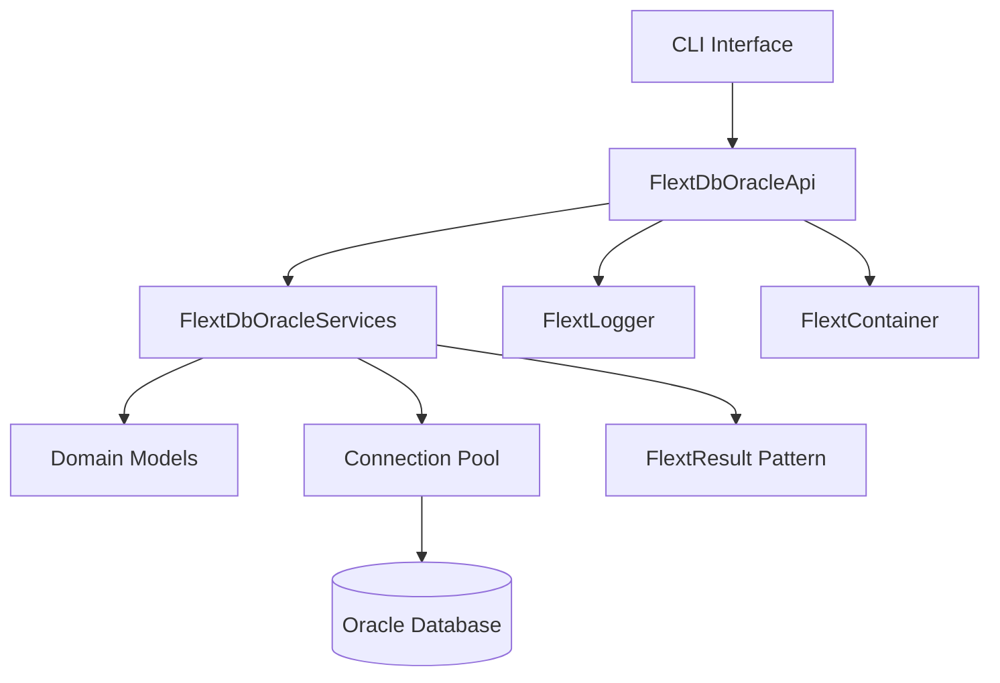

# flext-db-oracle

**Oracle Database Integration for the FLEXT Ecosystem** providing Oracle connectivity using **SQLAlchemy 2.0** and **python-oracledb** with FLEXT architectural patterns.

> **⚠️ STATUS**: Core functionality implemented. CLI formatters incomplete, no async support, DataFrame features pending.

---

## 🎯 Purpose and Role in FLEXT Ecosystem

### For the FLEXT Ecosystem

flext-db-oracle serves as the Oracle database foundation across 32+ FLEXT projects, providing standardized Oracle connectivity, schema management, and query execution with FLEXT patterns.

### Key Responsibilities

1. **Oracle Database Foundation** - Standardized Oracle integration for all FLEXT projects
2. **Singer Ecosystem Base** - Foundation for flext-tap-oracle, flext-target-oracle, flext-dbt-oracle
3. **Schema Management** - Oracle metadata extraction, DDL operations, schema comparison
4. **Connection Management** - Enterprise connection pooling and resource management

### Integration Points

- **flext-tap-oracle** → Oracle data extraction using this foundation
- **flext-target-oracle** → Oracle data loading through these services
- **flext-dbt-oracle** → Oracle transformations with shared connection patterns
- **All 32 FLEXT Projects** → Standardized Oracle operations when needed

---

## 🏗️ Architecture and Patterns

### FLEXT-Core Integration Status

| Pattern             | Status | Description                    |
| ------------------- | ------ | ------------------------------ |
| **FlextResult<T>**  | 🟢 95% | Comprehensive error handling   |
| **FlextService**    | 🟢 90% | Domain service patterns        |
| **FlextContainer**  | 🟡 70% | Dependency injection partial   |
| **Domain Patterns** | 🟢 85% | Clean Architecture with DDD    |

> **Status**: 🔴 Critical | 🟡 Partial | 🟢 Complete

### Architecture Overview



**Current Implementation**:
- 4,517 lines across 12 source files
- SQLAlchemy 2.0 with python-oracledb driver
- Connection pooling and transaction management
- 28 test files with 8,633 lines of validation

**Technology Gaps**:
- No async support (0 async methods found)
- No DataFrame integration (python-oracledb 3.4+ ready)
- No Oracle 23ai features (Vector types, statement pipelining)

---

## 🚀 Quick Start

### Installation

```bash
# Clone FLEXT ecosystem
git clone https://github.com/flext-sh/flext.git
cd flext/flext-db-oracle

# Install dependencies
poetry install

# Development setup
make setup
```

### Basic Usage

```python
from flext_db_oracle import FlextDbOracleApi, OracleConfig

# Configuration
config = OracleConfig(
    host="localhost",
    port=1521,
    service_name="XEPDB1",
    username="system",
    password="Oracle123"
)

# Create API instance
api = FlextDbOracleApi(config)

# Test connection
connection_result = api.test_connection()
if connection_result.is_success:
    print("✅ Connected to Oracle")

# Query with FlextResult pattern
result = api.query("SELECT table_name FROM user_tables WHERE rownum <= :limit", {"limit": 5})
if result.is_success:
    tables = result.unwrap()
    print(f"Found {len(tables)} tables")
```

## 🧪 Testing

### Test Structure

- **Unit Tests**: Fast validation without Oracle dependency
- **Integration Tests**: Real Oracle XE 21c container validation
- **Coverage**: 28 test files, 8,633 lines of test code

### Testing Commands

```bash
# Run all tests
make test

# Unit tests only (fast)
pytest -m unit

# Integration tests (requires Oracle container)
pytest -m integration

# Test with coverage
pytest --cov=src/flext_db_oracle --cov-report=html
```

## 🔧 Development

### Essential Commands

```bash
# Development setup
make setup                    # Install dependencies + pre-commit
make validate                 # Full validation pipeline
make test                     # Run test suite

# Code quality
make lint                     # Ruff linting
make type-check              # MyPy type checking
make format                  # Auto-format code

# Oracle development
docker-compose -f docker-compose.oracle.yml up -d
make oracle-connect          # Test Oracle connectivity
```

### Quality Gates

Zero tolerance quality requirements:

- **Linting**: Ruff with comprehensive rules
- **Type Safety**: MyPy strict mode
- **Security**: Bandit vulnerability scanning
- **Testing**: Unit and integration test coverage

## 📊 Status and Metrics

### Quality Standards

- **Coverage**: Target 90% (currently improving)
- **Type Safety**: MyPy strict mode enabled
- **Security**: Bandit vulnerability scanning
- **FLEXT-Core Compliance**: 87% integration patterns

### Ecosystem Integration

- **Direct Dependencies**: flext-tap-oracle, flext-target-oracle, flext-dbt-oracle
- **Service Dependencies**: flext-core (foundation), flext-cli (CLI patterns)
- **Integration Points**: 32+ FLEXT projects for Oracle operations

---

## 🗺️ Roadmap

### Current Version (0.9.0)

**Working Features**:
- SQLAlchemy 2.0 Oracle integration
- FlextResult error handling
- Connection pooling and management
- Schema introspection capabilities
- CLI interface structure

**Known Issues**:
- CLI formatters incomplete (SimpleNamespace placeholders)
- No async support (required for modern Python apps)
- No DataFrame integration (python-oracledb 3.4+ available)

### Next Version (0.10.0)

**Planned Improvements**:
- Complete CLI formatter implementation
- Async support for modern frameworks
- DataFrame integration for data science workflows
- Oracle 23ai Vector type support for AI applications

---

## 📚 Documentation

- **[Getting Started](docs/getting-started.md)** - Installation and setup
- **[Architecture](docs/architecture.md)** - Design patterns and structure
- **[API Reference](docs/api-reference.md)** - Complete API documentation
- **[Development](docs/development.md)** - Contributing and workflows
- **[Integration](docs/integration.md)** - Ecosystem integration patterns
- **[Troubleshooting](docs/troubleshooting.md)** - Common issues
- **[TODO & Roadmap](TODO.md)** - Development status and plans

---

## 🤝 Contributing

### FLEXT-Core Compliance Checklist

- [ ] Use FlextResult for all error handling
- [ ] Implement FlextDomainService patterns
- [ ] Follow Clean Architecture principles
- [ ] Add comprehensive type hints
- [ ] Include working code examples

### Quality Standards

All contributions must pass:
- `make validate` - Complete validation pipeline
- Code review for FLEXT pattern compliance
- Integration test validation with Oracle container

---

## 📄 License

MIT License - see [LICENSE](LICENSE) for details.

---

## 🆘 Support

- **Documentation**: [docs/](docs/)
- **Issues**: [GitHub Issues](https://github.com/flext-sh/flext/issues)
- **Security**: Report security issues privately to maintainers

---

**flext-db-oracle v0.9.0** - Oracle Database Integration foundation enabling standardized Oracle operations across the FLEXT ecosystem.

**Mission**: Provide reliable, type-safe Oracle database integration with modern Python patterns and FLEXT architectural standards.
