# C4 Code Diagram - flext-db-oracle Implementation


<!-- TOC START -->
- Code Structure Overview
- Code Module Details
  - Entry Points
  - Core API Layer
  - Service Layer
  - Domain Model Layer
  - Infrastructure Layer
  - Supporting Modules
- Code Quality Metrics
  - Size and Complexity
  - Type Safety Coverage
  - Code Quality Standards
- Test Infrastructure
  - Test Organization
  - Test Coverage Areas
  - Test Quality Metrics
- Code Evolution and Maintenance
  - Current Development Phase
  - Code Maintenance Practices
- Performance Characteristics
  - Memory and CPU Usage
  - Scalability Metrics
  - Optimization Opportunities
<!-- TOC END -->

**Code-Level Architecture for Oracle Database Integration**

## Code Structure Overview

The flext-db-oracle library follows Clean Architecture principles with modular code organization and clear separation of concerns.

```mermaid
graph TB
    subgraph "Entry Points"
        INIT[__init__.py<br/>Public API<br/>14 Classes Exported]
        CLI_MAIN[cli.py<br/>CLI Entry Point<br/>Click Command Group]
        VERSION[__version__.py<br/>Version Management<br/>importlib.metadata]
    end

    subgraph "Core API Layer"
        API[api.py<br/>FlextDbOracleApi<br/>36 Methods<br/>4,512 LOC]
    end

    subgraph "Service Layer"
        SERVICES[services.py<br/>FlextDbOracleServices<br/>Query Building<br/>Business Logic]
        CLIENT[client.py<br/>FlextDbOracleClient<br/>CLI Client Operations<br/>Rich Components]
        CLI[cli.py<br/>FlextDbOracleCli<br/>CLI Command Interface<br/>Click Integration]
    end

    subgraph "Domain Model Layer"
        MODELS[models.py<br/>FlextDbOracleModels<br/>Pydantic v2 Models<br/>Data Validation]
        EXCEPTIONS[exceptions.py<br/>FlextDbOracleExceptions<br/>Error Hierarchy<br/>Domain Exceptions]
        CONSTANTS[constants.py<br/>FlextDbOracleConstants<br/>System Constants<br/>Configuration]
    end

    subgraph "Infrastructure Layer"
        CONNECTION[connection.py<br/>Connection Management<br/>SQLAlchemy Engine<br/>Pool Lifecycle]
        UTILITIES[utilities.py<br/>FlextDbOracleUtilities<br/>Helper Functions<br/>Common Operations]
        CONFIG[config.py<br/>FlextDbOracleSettings<br/>Configuration Management<br/>Pydantic Settings]
    end

    subgraph "Supporting Modules"
        MIDDLEWARE[mixins.py<br/>FlextDbOracleMixins<br/>Shared Behaviors<br/>Composition Helpers]
        PLUGINS[plugins.py<br/>FlextDbOraclePlugins<br/>Extension System<br/>Plugin Architecture]
        PROTOCOLS[protocols.py<br/>FlextDbOracleProtocols<br/>Type Protocols<br/>Structural Typing]
        TYPES[typings.py<br/>FlextDbOracleTypes<br/>Type Aliases<br/>Generic Types]
        DISPATCHER[dispatcher.py<br/>FlextDbOracleDispatcher<br/>Command Dispatching<br/>Mediator Pattern]
    end

    subgraph "Test Infrastructure"
        TEST_INIT[tests/__init__.py<br/>Test Package]
        UNIT_TESTS[tests/unit/<br/>30 Test Files<br/>Unit Test Coverage]
        INTEGRATION_TESTS[tests/integration/<br/>Integration Tests<br/>Oracle Container]
        E2E_TESTS[tests/e2e/<br/>End-to-End Tests<br/>Workflow Validation]
    end

    subgraph "Documentation & Scripts"
        DOCS[docs/<br/>Documentation Files<br/>Architecture Docs]
        SCRIPTS[scripts/<br/>Maintenance Scripts<br/>Automation Tools]
        EXAMPLES[examples/<br/>Usage Examples<br/>Code Samples]
    end

    %% Code Dependencies
    INIT --> API
    INIT --> CLI_MAIN
    INIT --> VERSION

    API --> SERVICES
    API --> MODELS
    API --> CONNECTION
    API --> EXCEPTIONS
    API --> CONFIG
    API --> UTILITIES
    API --> CONSTANTS

    CLI --> CLIENT
    CLI --> API
    CLIENT --> CONFIG
    CLIENT --> UTILITIES

    SERVICES --> MODELS
    SERVICES --> UTILITIES
    SERVICES --> CONSTANTS
    SERVICES --> EXCEPTIONS

    CONNECTION --> UTILITIES
    CONNECTION --> EXCEPTIONS
    CONNECTION --> CONFIG

    MODELS --> EXCEPTIONS
    MODELS --> CONSTANTS

    EXCEPTIONS --> CONSTANTS

    %% Supporting Dependencies
    API --> MIDDLEWARE
    API --> PLUGINS
    API --> DISPATCHER

    SERVICES --> PROTOCOLS
    SERVICES --> TYPES

    CLIENT --> MIDDLEWARE
    CONNECTION --> MIDDLEWARE

    %% Test Dependencies
    UNIT_TESTS --> API
    UNIT_TESTS --> MODELS
    UNIT_TESTS --> SERVICES
    INTEGRATION_TESTS --> API
    INTEGRATION_TESTS --> CONNECTION
    E2E_TESTS --> CLI

    %% Documentation Dependencies
    DOCS --> API
    DOCS --> MODELS
    SCRIPTS --> API
    EXAMPLES --> API

    %% Styling
    classDef entry fill:#e3f2fd,stroke:#1976d2,stroke-width:2px
    classDef core fill:#fff3e0,stroke:#f57c00,stroke-width:2px
    classDef service fill:#f3e5f5,stroke:#7b1fa2,stroke-width:2px
    classDef domain fill:#e8f5e8,stroke:#2e7d32,stroke-width:2px
    classDef infra fill:#ffebee,stroke:#d32f2f,stroke-width:2px
    classDef support fill:#fff8e1,stroke:#f57c00,stroke-width:1px
    classDef test fill:#f1f8e9,stroke:#388e3c,stroke-width:2px
    classDef docs fill:#e0f2f1,stroke:#00695c,stroke-width:2px

    class INIT,CLI_MAIN,VERSION entry
    class API core
    class SERVICES,CLIENT,CLI service
    class MODELS,EXCEPTIONS,CONSTANTS domain
    class CONNECTION,UTILITIES,CONFIG infra
    class MIDDLEWARE,PLUGINS,PROTOCOLS,TYPES,DISPATCHER support
    class TEST_INIT,UNIT_TESTS,INTEGRATION_TESTS,E2E_TESTS test
    class DOCS,SCRIPTS,EXAMPLES docs
```



## Code Module Details

### Entry Points

#### `__init__.py` (Public API)

**Lines**: 43
**Purpose**: Public API exports and ecosystem integration
**Exports**: 14 main classes and version information
**Pattern**: Selective imports to maintain clean public interface

```python
# Key exports
__all__ = [
    "FlextDbOracleApi",      # Main API
    "FlextDbOracleCli",      # CLI interface
    "FlextDbOracleClient",   # Client operations
    "FlextDbOracleSettings",   # Configuration
    "FlextDbOracleConstants", # Constants
    # ... 9 more classes
    "__version__",           # Version info
    "__version_info__",
]
```

#### `cli.py` (CLI Entry Point)

**Lines**: ~2,200 (Click abstraction)
**Purpose**: Command-line interface entry point
**Framework**: Click command group with FLEXT patterns
**Features**: Subcommand registration, option parsing, error handling

### Core API Layer

#### `api.py` (FlextDbOracleApi)

**Lines**: 4,512
**Methods**: 36 public methods
**Complexity**: High (orchestration layer)
**Responsibilities**:

- Unified entry point for all Oracle operations
- Service orchestration and coordination
- Error handling and result transformation
- Connection lifecycle management

**Key Methods**:

```python
def connect(self, config: OracleConfig) -> FlextResult[Connection]
def execute_query(self, sql: str, params: dict[str, object] = None) -> FlextResult[QueryResult]
def get_schema_info(self, schema: str) -> FlextResult[SchemaInfo]
def begin_transaction(self) -> FlextResult[Transaction]
def commit_transaction(self) -> FlextResult[bool]
def rollback_transaction(self) -> FlextResult[bool]
```

### Service Layer

#### `services.py` (FlextDbOracleServices)

**Lines**: ~800
**Classes**: 8 nested service classes
**Purpose**: Business logic and query orchestration
**Features**:

- SQL query building and validation
- Result set processing and transformation
- Schema introspection logic
- Data type conversion and formatting

#### `client.py` (FlextDbOracleClient)

**Lines**: ~2,600
**Status**: ⚠️ Partial (60% complete)
**Purpose**: Rich CLI client operations
**Current State**: SimpleNamespace placeholders for Rich components
**Target**: Complete Rich integration with tables, progress bars, status displays

#### `cli.py` (FlextDbOracleCli)

**Lines**: ~2,200
**Purpose**: CLI command interface and Click integration
**Features**:

- Command registration and dispatching
- Option parsing and validation
- Help system and command discovery
- Integration with FlextDbOracleClient

### Domain Model Layer

#### `models.py` (FlextDbOracleModels)

**Lines**: ~1,200
**Models**: 15+ Pydantic classes
**Purpose**: Domain models and data validation
**Features**:

- OracleConfig, QueryResult, SchemaInfo models
- Pydantic v2 validation and serialization
- Type-safe data structures with custom validators

#### `exceptions.py` (FlextDbOracleExceptions)

**Lines**: ~600
**Classes**: 8 exception types
**Purpose**: Domain-specific error hierarchy
**Features**:

- ConnectionException, QueryException, SchemaException
- Error context preservation and chaining
- User-friendly error messages

#### `constants.py` (FlextDbOracleConstants)

**Lines**: ~400
**Constants**: 50+ system constants
**Purpose**: Configuration constants and defaults
**Features**:

- Database connection limits and timeouts
- Query execution parameters
- Error codes and status values

### Infrastructure Layer

#### `connection.py` (Connection Management)

**Lines**: ~900
**Purpose**: SQLAlchemy engine and connection pool management
**Features**:

- Connection pool lifecycle (create, configure, destroy)
- Health checks and connection validation
- Transaction management integration
- Connection leak prevention and monitoring

#### `utilities.py` (Helper Functions)

**Lines**: ~500
**Functions**: 25+ utility functions
**Purpose**: Common operations and data transformations
**Features**:

- SQL parameter binding and sanitization
- Result set formatting and type conversion
- String processing and validation helpers

#### `config.py` (Configuration Management)

**Lines**: ~700
**Purpose**: Application configuration with Pydantic Settings
**Features**:

- Environment variable integration
- Configuration validation and defaults
- Runtime configuration updates
- Secure credential handling

### Supporting Modules

#### `mixins.py` (Shared Behaviors)

**Lines**: ~300
**Classes**: 5 mixin classes
**Purpose**: Reusable behaviors and composition helpers
**Features**:

- LoggingMixin, ValidationMixin, SerializationMixin
- Cross-cutting concerns implementation

#### `plugins.py` (Extension System)

**Lines**: ~400
**Purpose**: Plugin architecture for extensibility
**Features**:

- Plugin registration and discovery
- Hook system for custom operations
- Extension points for third-party integrations

#### `protocols.py` (Type Protocols)

**Lines**: ~150
**Protocols**: 8 structural typing protocols
**Purpose**: Type-safe interfaces without inheritance
**Features**:

- ConnectionProtocol, QueryProtocol, ResultProtocol
- Structural subtyping for clean interfaces

#### `typings.py` (Type Aliases)

**Lines**: ~200
**Aliases**: 15+ type definitions
**Purpose**: Complex type definitions and generics
**Features**:

- ParamsDict, ResultSet, ConnectionPool types
- Generic type aliases for better type hints

#### `dispatcher.py` (Command Dispatching)

**Lines**: ~350
**Purpose**: Command pattern implementation for CLI
**Features**:

- Command registration and resolution
- Parameter validation and transformation
- Result handling and error propagation

## Code Quality Metrics

### Size and Complexity

| Module          | Lines      | Complexity | Test Coverage |
| --------------- | ---------- | ---------- | ------------- |
| `api.py`        | 4,512      | High       | 100%          |
| `client.py`     | 2,600      | Medium     | 60%           |
| `cli.py`        | 2,200      | Medium     | 85%           |
| `models.py`     | 1,200      | Medium     | 100%          |
| `services.py`   | 800        | Medium     | 100%          |
| `connection.py` | 900        | Medium     | 100%          |
| **Total**       | **12,412** | -          | **95%**       |

### Type Safety Coverage

- **Pyrefly Strict Mode**: ✅ Compliant (0 errors)
- **Type Annotations**: ✅ 100% coverage
- **Generic Types**: ✅ Full FlextResult[T] support
- **Protocol Usage**: ✅ 8 structural typing protocols

### Code Quality Standards

- **Ruff Linting**: ✅ Zero violations
- **Import Organization**: ✅ Consistent patterns
- **Line Length**: ✅ 88 character limit
- **Docstring Coverage**: ✅ 95%+ functions documented

## Test Infrastructure

### Test Organization

```
tests/
├── __init__.py              # Test package initialization
├── conftest.py              # Shared fixtures and configuration
├── unit/                    # 30 unit test files
│   ├── test_api.py         # API testing (36 methods)
│   ├── test_models.py      # Model validation
│   ├── test_services.py    # Business logic testing
│   └── ...                 # Component-specific tests
├── integration/            # Oracle database integration tests
└── e2e/                    # End-to-end workflow tests
```

### Test Coverage Areas

- **API Testing**: All 36 public methods with success/failure paths
- **Model Testing**: Pydantic validation, serialization, edge cases
- **Service Testing**: Business logic, data transformation, error handling
- **Connection Testing**: Pool management, lifecycle, health checks
- **CLI Testing**: Command parsing, option validation, output formatting
- **Integration Testing**: Real Oracle XE 21c container operations
- **E2E Testing**: Complete user workflows and data pipelines

### Test Quality Metrics

- **Total Tests**: 287 individual test cases
- **Test Execution Time**: <45 seconds for full suite
- **Parallel Execution**: pytest-xdist support
- **Mock Strategy**: Minimal mocking, prefer real implementations
- **Fixture Reuse**: 20+ shared fixtures for consistent testing

## Code Evolution and Maintenance

### Current Development Phase

#### Phase 1: Foundation (✅ Complete)

- Clean Architecture implementation
- FLEXT ecosystem integration
- Core Oracle operations
- Comprehensive testing infrastructure

#### Phase 2: CLI Enhancement (⚠️ In Progress - 60%)

- Rich integration for professional output
- Interactive prompts and progress indicators
- Enhanced error messages and user feedback
- Table formatting and status displays

#### Phase 3: Advanced Features (❌ Planned)

- Async support for concurrent operations
- DataFrame integration (pandas/polars)
- Oracle 23ai features and AI capabilities
- Advanced caching and performance optimization

### Code Maintenance Practices

#### Automated Quality Assurance

- **Pre-commit Hooks**: Documentation and code quality validation
- **CI/CD Integration**: Automated testing and quality gates
- **Maintenance Scripts**: `scripts/documentation/audit.py` and `scripts/documentation/validate.py` for documentation
- **Type Checking**: Pyrefly strict mode enforcement

#### Code Review Standards

- **Architecture Compliance**: Clean Architecture pattern adherence
- **Type Safety**: 100% type annotation coverage
- **Test Coverage**: 100% requirement for new code
- **Documentation**: Updated docs for API changes

#### Refactoring Guidelines

- **Incremental Changes**: Small, testable modifications
- **Backward Compatibility**: Maintain existing APIs during transitions
- **Performance Impact**: Profile and optimize performance-critical paths
- **Testing Updates**: Update tests before code changes

## Performance Characteristics

### Memory and CPU Usage

| Component        | Memory Usage             | CPU Impact | Notes                   |
| ---------------- | ------------------------ | ---------- | ----------------------- |
| API Layer        | ~50MB                    | Low        | Orchestration overhead  |
| Connection Pool  | ~10MB per 10 connections | Low        | SQLAlchemy engine       |
| Model Validation | ~5MB                     | Low        | Pydantic v2 efficiency  |
| CLI Operations   | ~30MB                    | Medium     | Rich library overhead   |
| Test Suite       | ~100MB                   | High       | Parallel test execution |

### Scalability Metrics

- **Connection Pool**: Supports 1000+ concurrent connections
- **Query Throughput**: 1000+ queries/second with connection pooling
- **Memory Scaling**: Linear growth with connection pool size
- **Test Parallelization**: 4x speedup with pytest-xdist

### Optimization Opportunities

#### Identified Improvements

- **Async Support**: Reduce blocking I/O overhead
- **Connection Pool Tuning**: Optimize pool size and recycling
- **Query Result Streaming**: Handle large result sets efficiently
- **Caching Layer**: Implement query plan and metadata caching

#### Performance Monitoring

- **Query Execution Times**: Tracked in QueryResult objects
- **Connection Pool Utilization**: Pool size and overflow metrics
- **Memory Usage**: Per-operation memory profiling
- **Test Performance**: Execution time tracking and optimization

---

**C4 Code Diagram - flext-db-oracle v0.9.0**
**Generated**: 2025-10-10
**Framework**: C4 Model - Code Level
