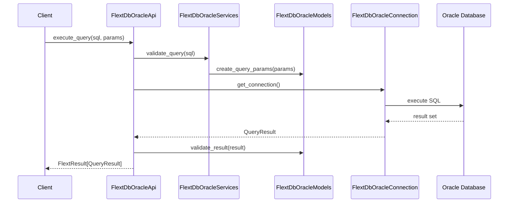
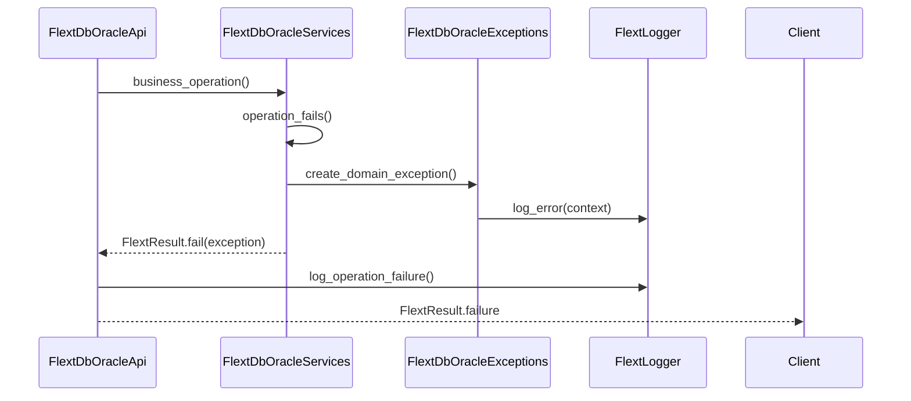
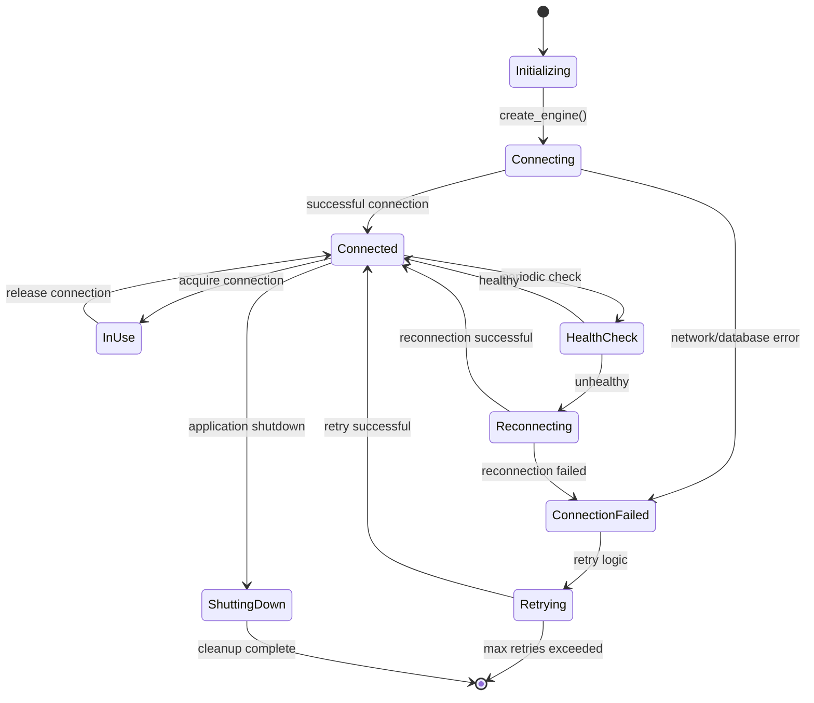

# C4 Component Diagram - flext-db-oracle API

<!-- TOC START -->

- [Component Overview](#component-overview)
- [Component Descriptions](#component-descriptions)
  - [Application Layer Components](#application-layer-components)
  - [Domain Layer Components](#domain-layer-components)
  - [Infrastructure Layer Components](#infrastructure-layer-components)
  - [Cross-Cutting Components](#cross-cutting-components)
- [Component Interaction Patterns](#component-interaction-patterns)
  - [Request Flow (API Usage)](#request-flow-api-usage)
  - [Error Handling Flow](#error-handling-flow)
  - [Connection Management Flow](#connection-management-flow)
- [Component Quality Attributes](#component-quality-attributes)
  - [Reliability](#reliability)
  - [Performance](#performance)
  - [Maintainability](#maintainability)
  - [Security](#security)
- [Component Evolution](#component-evolution)
  - [Current State (v0.9.0)](#current-state-v090)
  - [Future Enhancements](#future-enhancements)

<!-- TOC END -->

**Component Architecture for flext-db-oracle Library**

## Component Overview

The flext-db-oracle library implements Clean Architecture principles with clear separation between domain, application, and infrastructure layers.

```mermaid
graph TB
    subgraph "Application Layer"
        API[FlextDbOracleApi<br/>🎯 Main API<br/>Orchestrator<br/>Facade Pattern]

        CLI[FlextDbOracleCli<br/>💻 CLI Interface<br/>Command Pattern]

        CLIENT[FlextDbOracleClient<br/>🎭 Client Operations<br/>Rich UI Components<br/>Strategy Pattern]
    end

    subgraph "Domain Layer"
        MODELS[FlextDbOracleModels<br/>📋 Domain Models<br/>OracleConfig, QueryResult<br/>Entity Pattern]

        SERVICES[FlextDbOracleServices<br/>🔧 Business Logic<br/>Query Building & Validation<br/>Service Pattern]

        EXCEPTIONS[FlextDbOracleExceptions<br/>❌ Domain Exceptions<br/>Error Hierarchy<br/>Exception Pattern]
    end

    subgraph "Infrastructure Layer"
        CONNECTION[FlextDbOracleConnection<br/>🔗 Connection Management<br/>SQLAlchemy Engine<br/>Pool Pattern]

        UTILITIES[FlextDbOracleUtilities<br/>🛠️ Helper Functions<br/>Common Operations<br/>Utility Pattern]

        CONSTANTS[FlextDbOracleConstants<br/>📝 System Constants<br/>Configuration<br/>Constant Pattern]
    end

    subgraph "Cross-Cutting Concerns"
        CONFIG[FlextDbOracleSettings<br/>⚙️ Configuration<br/>Pydantic Settings<br/>Configuration Pattern]

        LOGGER[FlextLogger<br/>📊 Structured Logging<br/>JSON Format<br/>Logging Pattern]

        CONTAINER[FlextContainer<br/>📦 Dependency Injection<br/>Service Locator<br/>Container Pattern]
    end

    subgraph "External Interfaces"
        SQLALCHEMY[SQLAlchemy 2.0<br/>🏗️ ORM Engine<br/>Query Building]

        ORACLEDB[python-oracledb<br/>🗄️ Database Driver<br/>Connection Pool]

        ORACLE[(Oracle Database<br/>Primary Storage)]

        PYDANTIC[Pydantic v2<br/>✅ Data Validation<br/>Type Safety]

        FLEXT_CORE[flext-core<br/>🏛️ Foundation Patterns<br/>FlextResult[T]]

        CLICK[Click<br/>💻 CLI Framework<br/>Command Line]

        RICH[Rich<br/>🎨 Terminal UI<br/>Rich Formatting]
    end

    %% Internal Component Relationships
    API --> SERVICES
    API --> MODELS
    API --> CONNECTION
    API --> EXCEPTIONS

    CLI --> CLIENT
    CLI --> API

    CLIENT --> CONFIG
    CLIENT --> LOGGER

    SERVICES --> MODELS
    SERVICES --> UTILITIES
    SERVICES --> CONSTANTS

    CONNECTION --> UTILITIES
    CONNECTION --> EXCEPTIONS

    %% Cross-Cutting Relationships
    API --> CONTAINER
    API --> LOGGER
    API --> CONFIG

    SERVICES --> LOGGER
    CONNECTION --> LOGGER

    %% External Dependencies
    CONNECTION --> SQLALCHEMY
    SQLALCHEMY --> ORACLEDB
    ORACLEDB --> ORACLE

    MODELS --> PYDANTIC
    CONFIG --> PYDANTIC

    API --> FLEXT_CORE
    SERVICES --> FLEXT_CORE
    EXCEPTIONS --> FLEXT_CORE

    CLI --> CLICK
    CLIENT --> RICH

    %% Styling
    classDef application fill:#e3f2fd,stroke:#1976d2,stroke-width:2px
    classDef domain fill:#f3e5f5,stroke:#7b1fa2,stroke-width:2px
    classDef infrastructure fill:#fff3e0,stroke:#f57c00,stroke-width:2px
    classDef crosscutting fill:#e8f5e8,stroke:#2e7d32,stroke-width:2px
    classDef external fill:#ffebee,stroke:#d32f2f,stroke-width:2px

    class API,CLI,CLIENT application
    class MODELS,SERVICES,EXCEPTIONS domain
    class CONNECTION,UTILITIES,CONSTANTS infrastructure
    class CONFIG,LOGGER,CONTAINER crosscutting
    class SQLALCHEMY,ORACLEDB,ORACLE,PYDANTIC,FLEXT_CORE,CLICK,RICH external
```

## Component Descriptions

### Application Layer Components

#### FlextDbOracleApi (Main API)

**Pattern**: Facade Pattern
**Responsibilities**:

- Unified entry point for all Oracle operations
- Orchestrates service calls and error handling
- Implements railway-oriented programming with FlextResult[T]
- Provides both sync and async operation support

**Key Interfaces**:

```python
class FlextDbOracleApi(FlextService):
    def connect(self, config: OracleConfig) -> FlextResult[Connection]
    def execute_query(self, sql: str, params: dict[str, object] = None) -> FlextResult[QueryResult]
    def get_schema_info(self, schema: str) -> FlextResult[SchemaInfo]
    def close_connection(self) -> FlextResult[bool]
```

**Dependencies**: Services, Models, Connection, Exceptions, Logger, Container

#### FlextDbOracleCli (CLI Interface)

**Pattern**: Command Pattern
**Responsibilities**:

- Command-line interface for REDACTED_LDAP_BIND_PASSWORDistrative operations
- Command registration and dispatching
- User interaction and feedback
- Integration with Click framework

**Key Features**:

- Connection testing commands
- Schema inspection commands
- Query execution commands
- Configuration management commands

#### FlextDbOracleClient (Client Operations)

**Pattern**: Strategy Pattern
**Responsibilities**:

- Rich terminal UI components
- Output formatting and display
- User interaction handling
- Progress indication and status updates

**Current State**: Placeholder implementations (SimpleNamespace) - Phase 2 enhancement target

### Domain Layer Components

#### FlextDbOracleModels (Domain Models)

**Pattern**: Entity Pattern
**Responsibilities**:

- Pydantic v2 models for data validation
- Domain entity definitions (OracleConfig, QueryResult, etc.)
- Type-safe data structures
- Serialization and deserialization

**Key Models**:

```python
class OracleConfig(BaseModel):
    host: str
    port: int = 1521
    service_name: str
    username: str
    password: SecretStr

class QueryResult(BaseModel):
    rows: List[List[object]]
    columns: t.StringList
    row_count: int
    execution_time: float
```

#### FlextDbOracleServices (Business Logic)

**Pattern**: Service Pattern
**Responsibilities**:

- Query building and optimization
- Business rule validation
- Data transformation and processing
- Domain logic orchestration

**Key Services**:

- SQL query construction and validation
- Result set processing and formatting
- Schema introspection logic
- Transaction management coordination

#### FlextDbOracleExceptions (Domain Exceptions)

**Pattern**: Exception Pattern
**Responsibilities**:

- Domain-specific error hierarchy
- Error classification and handling
- User-friendly error messages
- Exception chaining and context preservation

**Exception Hierarchy**:

```
FlextDbOracleException (base)
├── ConnectionException
├── QueryException
├── SchemaException
├── ConfigurationException
└── ValidationException
```

### Infrastructure Layer Components

#### FlextDbOracleConnection (Connection Management)

**Pattern**: Pool Pattern
**Responsibilities**:

- SQLAlchemy engine management
- Connection pool lifecycle
- Database connectivity handling
- Connection health monitoring

**Features**:

- Configurable connection pools (size, overflow, timeout)
- Automatic connection recycling and health checks
- Transaction management integration
- Connection leak prevention

#### FlextDbOracleUtilities (Helper Functions)

**Pattern**: Utility Pattern
**Responsibilities**:

- Common utility functions
- Data type conversions
- String processing and sanitization
- Helper methods for common operations

#### FlextDbOracleConstants (System Constants)

**Pattern**: Constant Pattern
**Responsibilities**:

- System-wide constants and configuration
- Default values and limits
- Enumeration definitions
- Magic number elimination

### Cross-Cutting Components

#### FlextDbOracleSettings (Configuration)

**Pattern**: Configuration Pattern
**Responsibilities**:

- Application configuration management
- Environment variable handling
- Configuration validation and defaults
- Runtime configuration updates

#### FlextLogger (Logging)

**Pattern**: Logging Pattern
**Responsibilities**:

- Structured JSON logging
- Configurable log levels
- Context propagation
- Performance-aware logging

#### FlextContainer (Dependency Injection)

**Pattern**: Container Pattern
**Responsibilities**:

- Service registration and resolution
- Dependency injection management
- Singleton and factory patterns
- Service lifecycle management

## Component Interaction Patterns

### Request Flow (API Usage)



### Error Handling Flow



### Connection Management Flow



## Component Quality Attributes

### Reliability

- **Error Handling**: Comprehensive exception handling with FlextResult[T]
- **Connection Resilience**: Automatic retry and recovery mechanisms
- **Data Integrity**: Transaction management with rollback capabilities
- **Resource Management**: Proper cleanup and leak prevention

### Performance

- **Connection Pooling**: Efficient connection reuse and management
- **Query Optimization**: Prepared statements and parameter binding
- **Memory Management**: Streaming results for large datasets
- **Caching**: Query plan and metadata caching

### Maintainability

- **Clean Architecture**: Clear separation of concerns and dependencies
- **Type Safety**: 100% type coverage with modern Python features
- **Testability**: Comprehensive test coverage with isolated components
- **Documentation**: Automated documentation maintenance

### Security

- **Input Validation**: Pydantic models for data validation
- **SQL Injection Prevention**: Parameterized queries and prepared statements
- **Credential Management**: Secure password handling with SecretStr
- **Audit Logging**: Comprehensive operation logging for security monitoring

## Component Evolution

### Current State (v0.9.0)

- ✅ **Foundation Components**: API, Models, Services, Connection fully implemented
- ✅ **Domain Layer**: Complete with proper separation of concerns
- ✅ **Infrastructure**: SQLAlchemy integration with connection pooling
- ⚠️ **CLI Components**: Basic structure, Rich integration in progress

### Future Enhancements

- **Async Components**: asyncio support for concurrent operations
- **DataFrame Components**: pandas/polars integration for analytics
- **Monitoring Components**: Advanced observability and metrics
- **Plugin Components**: Extensible architecture for custom operations

______________________________________________________________________

**C4 Component Diagram - flext-db-oracle v0.9.0**
**Generated**: 2025-10-10
**Framework**: C4 Model - Component Level
