# C4 Context Diagram - flext-db-oracle

**System Context for Oracle Database Integration in FLEXT Ecosystem**

## Context Overview

The flext-db-oracle library provides enterprise-grade Oracle database connectivity and operations within the FLEXT data integration ecosystem. It serves as the foundation for all Oracle-related data operations across FLEXT projects.

```mermaid
graph TB
    subgraph "FLEXT Ecosystem"
        TAP[flext-tap-oracle<br/>Data Extraction]
        TARGET[flext-target-oracle<br/>Data Loading]
        DBT[flext-dbt-oracle<br/>Data Transformation]
        client-a[client-a-oud-mig<br/>Migration Tools]
    end

    subgraph "External Systems"
        ORACLE[(Oracle Database<br/>XE 21c/19c/18c)]
        OIC[Oracle Integration Cloud<br/>OIC]
        WMS[Oracle Warehouse Management<br/>WMS]
        AD[Active Directory<br/>LDAP]
        OPENLDAP[OpenLDAP<br/>Directory]
    end

    subgraph "Development Tools"
        POETRY[Poetry<br/>Dependency Management]
        PYTEST[pytest<br/>Testing Framework]
        RUFF[Ruff<br/>Code Quality]
        PYREFLY[Pyrefly<br/>Type Checking]
    end

    subgraph "Infrastructure"
        DOCKER[Docker<br/>Containerization]
        GITHUB[GitHub<br/>CI/CD Platform]
        PYPI[PyPI<br/>Package Distribution]
    end

    %% Core Library
    LIB[flext-db-oracle<br/>Core Library<br/>🐍 Python 3.13+]

    %% Connections
    TAP --> LIB
    TARGET --> LIB
    DBT --> LIB
    client-a --> LIB

    LIB --> ORACLE
    LIB --> OIC
    LIB --> WMS
    LIB --> AD
    LIB --> OPENLDAP

    LIB --> POETRY
    LIB --> PYTEST
    LIB --> RUFF
    LIB --> PYREFLY

    LIB --> DOCKER
    LIB --> GITHUB
    LIB --> PYPI

    %% Styling
    classDef ecosystem fill:#e1f5fe,stroke:#01579b,stroke-width:2px
    classDef external fill:#fff3e0,stroke:#e65100,stroke-width:2px
    classDef tools fill:#f3e5f5,stroke:#6a1b9a,stroke-width:2px
    classDef infra fill:#e8f5e8,stroke:#2e7d32,stroke-width:2px
    classDef core fill:#fff8e1,stroke:#f57c00,stroke-width:3px

    class TAP,TARGET,DBT,client-a ecosystem
    class ORACLE,OIC,WMS,AD,OPENLDAP external
    class POETRY,PYTEST,RUFF,PYREFLY tools
    class DOCKER,GITHUB,PYPI infra
    class LIB core
```

## System Purpose

**flext-db-oracle** provides a unified, enterprise-grade interface for Oracle database operations within the FLEXT ecosystem. It abstracts the complexities of SQLAlchemy 2.0 and Python-oracledb while providing:

- **Type-safe database operations** with Pydantic v2 models
- **Railway-oriented error handling** with FlextResult[T]
- **Clean Architecture** implementation following DDD principles
- **Comprehensive testing** with 100% coverage requirement
- **Production monitoring** and observability integration

## External System Interactions

### Database Systems

- **Oracle Database XE 21c/19c/18c**: Primary database backend with full SQL support
- **Oracle Integration Cloud (OIC)**: Cloud-based integration platform
- **Oracle Warehouse Management (WMS)**: Specialized warehouse operations
- **Directory Services**: Active Directory and OpenLDAP for authentication

### Development Ecosystem

- **Poetry**: Dependency management and packaging
- **pytest**: Comprehensive testing framework with advanced features
- **Ruff**: Fast Python linter and formatter
- **Pyrefly**: Next-generation Python type checker

### Infrastructure

- **Docker**: Containerization for development and testing environments
- **GitHub**: Version control, CI/CD, and project management
- **PyPI**: Package distribution and dependency resolution

## User Personas

### Primary Users

#### Data Engineer

- **Needs**: Reliable, high-performance Oracle database connectivity
- **Concerns**: Connection stability, query performance, error handling
- **Usage**: Building data pipelines, ETL operations, real-time data processing

#### Application Developer

- **Needs**: Type-safe database operations, clean APIs, comprehensive error handling
- **Concerns**: API stability, documentation quality, integration complexity
- **Usage**: Building applications that interact with Oracle databases

#### DevOps Engineer

- **Needs**: Observable systems, monitoring capabilities, deployment automation
- **Concerns**: System reliability, performance metrics, security compliance
- **Usage**: Deploying and monitoring Oracle-based applications

### Secondary Stakeholders

#### System Administrator

- **Needs**: Database REDACTED_LDAP_BIND_PASSWORDistration tools, monitoring dashboards
- **Concerns**: System performance, resource utilization, security

#### QA Engineer

- **Needs**: Comprehensive test suites, reliable testing infrastructure
- **Concerns**: Test coverage, automation reliability, CI/CD integration

#### Product Manager

- **Needs**: Feature roadmap, release planning, stakeholder communication
- **Concerns**: Feature completeness, quality assurance, user satisfaction

## Quality Attributes

### Performance

- **Response Time**: <100ms for simple queries, <1s for complex operations
- **Throughput**: 1000+ concurrent connections supported
- **Resource Usage**: Minimal memory footprint, efficient connection pooling

### Reliability

- **Availability**: 99.9% uptime with proper error handling
- **Fault Tolerance**: Graceful degradation, automatic retry mechanisms
- **Data Integrity**: ACID compliance for transaction operations

### Security

- **Authentication**: Secure credential management
- **Authorization**: Role-based access control integration
- **Data Protection**: Encryption in transit and at rest

### Maintainability

- **Code Quality**: 100% type safety, comprehensive test coverage
- **Documentation**: Automated maintenance with quality assurance
- **Modularity**: Clean architecture with clear separation of concerns

## Constraints and Assumptions

### Technical Constraints

- **Python Version**: 3.13+ exclusive (modern type system requirements)
- **Database Support**: Oracle 18c+ with SQLAlchemy 2.0+ compatibility
- **Dependency Management**: Poetry-based with strict version pinning

### Business Constraints

- **License**: MIT licensed for maximum adoption
- **Ecosystem Integration**: Mandatory compatibility with FLEXT patterns
- **Quality Standards**: Zero-tolerance for critical issues

### Assumptions

- **Network Connectivity**: Reliable network access to Oracle databases
- **Resource Availability**: Sufficient compute resources for connection pooling
- **Security Context**: Secure environment for credential management
- **Maintenance Windows**: Planned maintenance windows for updates

## System Boundaries

### In Scope

- Oracle database connectivity and operations
- Connection pooling and lifecycle management
- Schema introspection and metadata extraction
- Query building and execution with error handling
- CLI interface for REDACTED_LDAP_BIND_PASSWORDistrative operations
- Comprehensive testing and quality assurance
- Documentation and maintenance automation

### Out of Scope

- Database server REDACTED_LDAP_BIND_PASSWORDistration (backup, restore, etc.)
- Data modeling and schema design
- Business logic implementation
- User interface development
- Hardware infrastructure management
- Third-party system integrations beyond Oracle

## Evolution and Roadmap

### Current Version (0.9.0)

- ✅ Foundation architecture with FLEXT integration
- ✅ Core Oracle operations (query, execute, schema)
- ✅ Type safety and comprehensive testing
- ⚠️ CLI enhancement in progress (60% complete)

### Future Versions

- **v1.0.0**: Production release with complete CLI functionality
- **v1.1.0**: Async support and performance optimizations
- **v1.2.0**: DataFrame integration and advanced analytics
- **v2.0.0**: Oracle 23ai features and AI/ML integration

---

**C4 Context Diagram - flext-db-oracle v0.9.0**
**Generated**: 2025-10-10
**Framework**: C4 Model - Context Level
